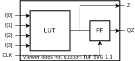

Forced non-sequential relations to an input
+++++++++++++++++++++++++++++++++++++++++++

This is a case when a macro block consisting of a LUT and an FF is to be modeled in VPR as a single primitive. The block has two outputs: the first one sources at the LUT directly and the second one passes through an external register:

.. no-license:: lut_ff_macro.sim.v
   :language: verilog
   :caption: tests/no_seq/lut_ff_macro.sim.v

Since relation of LUT inputs is combinational for one output and sequential for another they have to be defined in a special way as required by VPR (see `VTR documentation <https://docs.verilogtorouting.org/en/latest/tutorials/arch/timing_modeling/#sequential-block-with-internal-paths-and-combinational-input>`_). Due to the presence of the output register all sequential annotations are moved to the output port. Hence LUT inputs must not mention any clock signal. This can be achieved in V2X by specifying the `(* NO_SEQ *)` attribute on them. The attribute prevents V2X from annotating input ports with any clock relations.

.. literalinclude:: lut_ff_macro.model.xml
   :language: xml
   :caption: lut_ff_macro.model.xml

.. literalinclude:: lut_ff_macro.pb_type.xml
   :language: xml
   :caption: lut_ff_macro.pb_type.xml
