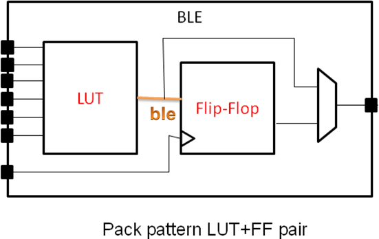

# LUT with FlipFlop Example

An example of the classical LUT with FlipFlop pair.

This is shown in `Figure 28` of the
[Architecture Reference section of the Verilog to Routing Documentation](https://docs.verilogtorouting.org/en/latest/arch/reference)
and reproduced below;

> 
> *Fig. 28 Pack Pattern Example.*

## Blackbox detection

 - [ ] model of the leaf `pb_type` is generated
 - [ ] leaf `pb_type` XML is generated
 - [ ] all dependency models and `pb_type`s are included in the output files

## Carry chain inference

 - [ ] `pack_pattern` inference - `pack_pattern`s defined on wires with `pack` attributes should be propagated to `pb_type` XMLs
